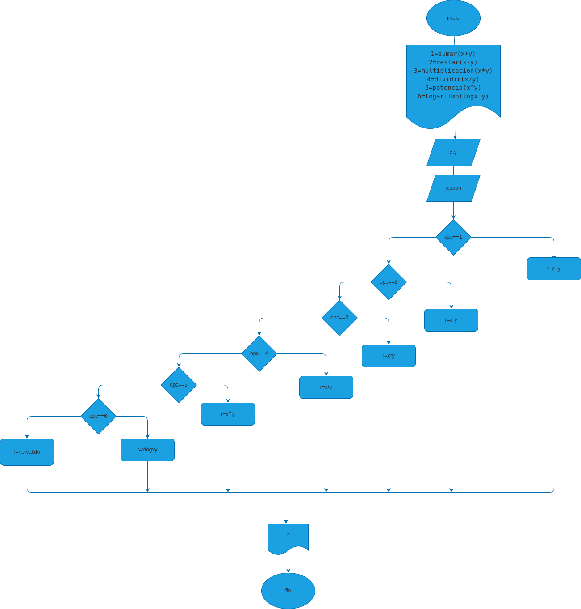

# mini_calculadora
programa para  calcular operaciones
# analisis
## input
### variables de entrada

1=sumar(x+y)

2=restar(x-y)

3=multiplicacion(x*y)

4=dividir(x/y)

5=potencia(x^y)

6=logaritmo(logx y)
##  proccesing
### entrada de datos
"ingrese el valor de x: "
"ingrese el valor de y: "
"seleccione la operacion a realizar: "

### input
"el resultado es: "

